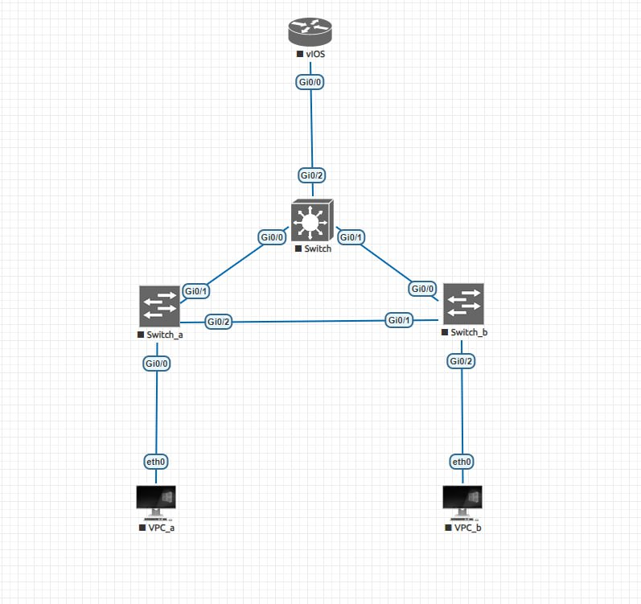

# Решение

## Схема:



## Пинги:

```bash
VPCS> ping 10.0.10.1

84 bytes from 10.0.10.1 icmp_seq=1 ttl=63 time=20.253 ms
84 bytes from 10.0.10.1 icmp_seq=2 ttl=63 time=9.005 ms
84 bytes from 10.0.10.1 icmp_seq=3 ttl=63 time=9.705 ms
84 bytes from 10.0.10.1 icmp_seq=4 ttl=63 time=8.983 ms
84 bytes from 10.0.10.1 icmp_seq=5 ttl=63 time=7.438 ms

VPCS>
```

```bash

VPCS> ping 10.0.20.1

84 bytes from 10.0.20.1 icmp_seq=1 ttl=63 time=7.152 ms
84 bytes from 10.0.20.1 icmp_seq=2 ttl=63 time=7.339 ms
84 bytes from 10.0.20.1 icmp_seq=3 ttl=63 time=7.514 ms
84 bytes from 10.0.20.1 icmp_seq=4 ttl=63 time=7.003 ms
84 bytes from 10.0.20.1 icmp_seq=5 ttl=63 time=6.459 ms

VPCS>

```